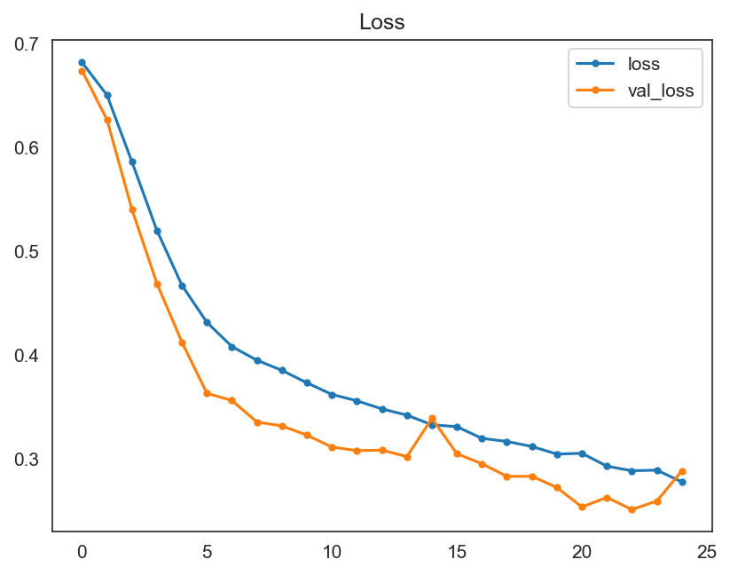
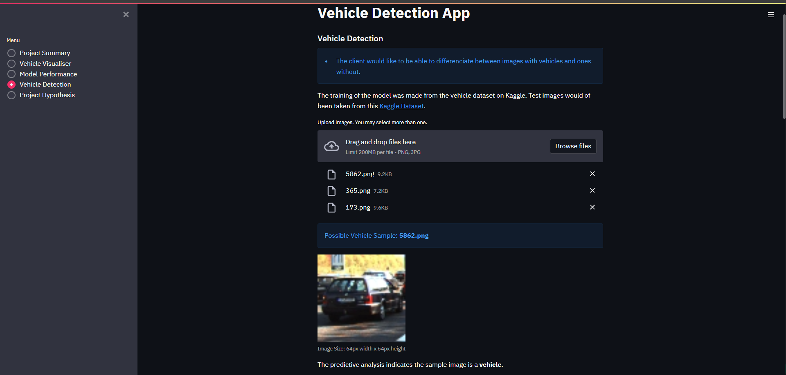

# Vehicle Detector


# Table of Contents

1. [Dataset Content](#dataset-content)
2. [Business Requirements](#business-requirements)
3. [Hypothesis and how to validate it?](#hypothesis-and-how-to-validate)
4. [Impliment Business Requirements](#impliment-business-requirements)
5. [ML Business Case](#ml-business-case)
6. [ML Model Development](#ml-model-development)
   1. [Version 1](#version-1)
7. [Hypotheses - Considerations and Validations](#hypotheses---considerations-and-validations)
8. [Dashboard Design](#dashboard-design)
9.  [Unfixed Bugs](#unfixed-bugs)
10. [Deployment](#deployment)
11. [Main Data Analysis and Machine Learning Libraries](#main-data-analysis-and-machine-learning-libraries)
12. [Other technologies used](#other-technologies-used)
13. [Issues](#issues)
14. [TESTING](#testing)
    1.  [Manual Testing](#manual-testing)
        1.  [User Story Testing](#user-story-testing)
    2. [Validation](#validation)
    3. [Automated Unit Tests](#automated-unit-tests)
15. [Credits](#credits)
16. [Acknowledgements](#acknowledgements)

## Dataset Content
The dataset is **Vehicle Detection Image Set** dataset from [Kaggle](https://www.kaggle.com/datasets/brsdincer/vehicle-detection-image-set). 

Two labels:
Non-Vehicles
Vehicles

This dataset is for machine learning process and computer vision steps and has 17760 images.

[Back to top ⇧](#table-of-contents)

## Business Requirements
The primary objective of this project is to develop a machine learning model for the detection of vehicles in an image. The model is designed for the orgainisers of vehicle festivals where cameras are set up at the enterance to capture vehicles entering with the intention of selling the photos. 

Requirements:

* Accuracy: The model should have a high accuracy rate in classifying images as either vehicles (1) or non-vehicles (0).
* Scalability: The solution should be scalable to handle a large volume of images from various sources.
* Speed: The model should be able to make predictions in real-time so that reliable and quick differentiations can be made.
* Interpretability: The model should be able to be understood by the client in a clear way that doesn't overwelm them.

Objectives:

1. The client would like to have a study of the dataset collected.
2. The client would like to have an ML model developed in order to be able to identify vehicles in images.

* A Streamlit dashboard will be developed as well to provide the client with a platform to be able to run the ML model. This will also show the analytics and performance of the model.


[Back to top ⇧](#table-of-contents)

## Hypothesis and How to Validate

1. After the study of the dataset was completed it showed that there was a clear difference in the two types of images that an ML model would be able to be trained on.

2. The model was able to differentiate between images that contained a vehicle and those that did not. The model was able to learn the basic shapes and lines that make up a vehicle and to predict to a high level of accuracy whether or not the image contained a vehicle.

[Back to top ⇧](#table-of-contents)

## Impliment Business Requirements

Accuracy: Visualisations of graphs will make the performance metrics comprehendable. Line graphs, pie charts and confusion matrices will be used to visually explain this.
Scalability:  We will analyze the model's performance on varying sizes of datasets using visualizations to ensure it scales efficiently.
Speed: Monitoring the model's inference time will ensure it meets the speed requirement.
Interpretability: Splitting the metrics data and detection funtion to different pages will allow non-technical users to run the app without issue.


**Business Requirement 1: Data Visualization**
1. As a client, I can navigate easily through an interactive dashboard so that I can view and understand the data.
2. As a client, I can view visual graphs, differences, and variabilities between images of vehicles and non-vehicles.
3. As a client, I can view a montage of images with and without vehicles, so I can make the visual differentiation.

**Business Requirement 2: Classification**
1. As a client, I can upload images to run the ML model and get an immediate prediction on whether it contains a vehicle or not.
2. As a client, I can save model predictions in a timestamped CSV file so that I can have a documented history of the predictions.

[Back to top ⇧](#table-of-contents)

## ML Business Case

* The client is interested in having an app that can accurately distinguish between images that have vehicles in them and those that do not. This will be achieved through development of a TensorFlow deep learning pipeline and trained from a dataset of images with vehicles and non-vehicles.

* The TensorFlow pipeline will utilise a convolutional neural network (CNN) which is a type of network that is most effective in identifying patterns and key features in image data.

* A binary classification model will be the goal of this ML pipeline with the outcome of being able to distinguish between images that contain vehicles and those that do not.

* The output of the model will be a classifiction label identifing whether it contains a vehicle or non-vehicle.

* If the image contains a vehicle then the client will be able to sell the photo to the owner of the vehicle if they wish. 

* If the image does not contain a vehicle the client is free to delete the image.

* The primary metrics for evaluating the success of this ML model will be overall model accuracy (measured by the F1 score) and recall for correctly identifying images with vehicles.

* Accuracy threshold should be set very high for the client to make sure that no non-vehicle images are displayed to potentional customers instead of images of their vehicles.

* A successful model for this project should be one that achieves an F1 score of over 0.85.


[Back to top ⇧](#table-of-contents)


## ML Model Development

The ML model is a CNN built using Keras, a high-level neural networks API. This model is designed for binary classification tasks, as indicated by the use of the 'softmax' activation function in the output layer and the binary cross-entropy loss function. Here's a breakdown of it's architecture:

### Version 1
There are three convolutional layers, each followed by a max pooling layer. These are used for feature extraction from the input images. Each convolutional layer is followed by a max pooling layer with a pool size of 2x2, which reduces the spatial dimensions of the output. After the convolutional and pooling layers, the model flattens the output to convert it into a one-dimensional array. This is necessary for feeding into the dense layers for classification.

Dense Layers: The first dense layer has 128 neurons and uses 'relu' activation. It serves as a fully connected layer that processes features extracted by the convolutional layers. This is followed by a dropout layer with a dropout rate of 0.2 to reduce overfitting by randomly setting input units to 0 during training. The final dense layer has 1 neuron with a 'softmax' activation function. This is suitable for binary classification, producing a probability output indicating the likelihood of belonging to one of the two classes.


Compilation: The model uses the 'adagrad' optimizer, a popular choice for deep learning models due to it's efficiency. The loss function is 'binary_crossentropy', which is standard for binary classification problems. The model seemed well-suited for tasks like image-based binary classification, which could include applications such as distinguishing between two different types of objects or conditions in images.


<details>
<summary>These are the results for the V1:</summary>





</details>

<br>

[Back to top ⇧](#table-of-contents)

## Hypotheses - Considerations and Validations

## Considerations:
1. **Visual Differentiation Hypothesis**
It was hypothesised that by studying the dataset it would show that there was a clear difference in the two types of images, vehicle and non-vehicle.  

2. **Deep Learning Classification Hypothesis:** 
It was hypothesised that an ML model would be able to differentiate between images that contained a vehicle and images that did not. This could be achieved by teaching the model the basic shaped and lines that make up a vehicle.  

## Validations:
1. **Visual Differentiation Hypothesis**
After the study of the dataset was completed it showed that there was a clear difference in the two types of images that an ML model would be able to be trained on.

2. **Deep Learning Classification Hypothesis:**
The model was able to differentiate between images that contained a vehicle and those that do not. The model was able to learn the basic shapes and lines that make up a vehicle and to predict to a high level of accuracy whether or not the image contained a vehicle.

The validation process for these hypotheses involved:

* Graphical evaluation of the model's performance, including monitoring accuracy and loss across training epochs.
* Testing the model's effectiveness through the use of a confusion matrix.

[Back to top ⇧](#table-of-contents)

## Dashboard Design

* This project uses a SteamLit dashboard that consists of 5 pages that the user is able to navigate through. The simple menu of these pages is located to the left of the screen.

# Project Summary

* The project summary page acts as both a summary of the project and the landing page. It explains why the project has been started and link to the readme file containing more detailed information.

<details>
<summary>Project Summary</summary>


</details>
<br>

# Vehicle Visualiser

* The first objective of this project is addressed on the vehicle visualiser page. This page includes the data analysis that has been conducted in the project saved as screenshots that can be toggled on and off.

<details>
<summary>Vehicle Visualiser</summary>


</details>

# Montage

* This page also includes the ability to create an image montage of both label classes, vehicle and non-vehicle, of a random set of validation images.

<details>
<summary>Montage</summary>


</details>
<br>

# Model Performance

* The model performance page shows graphs of how the dataset was split, the model accuracy and loss history, generalised performance and confusion matrix.

<details>
<summary>Model Performance</summary>


</details>
<br>

# Vehicle Detection

* The vehicle detection page allows the client to add new images to the project and find out whether they contain a vehicle or not.

<details>
<summary>Vehicle Detection</summary>

 
</details>
<br>

# Outputs

* Here is an example of the output detailing; the prediction made, a graph showing the percentage between vehicle and non-vehicle and the option to download the results as a CSV file.

<details>
<summary>Vehicle Detection Outputs</summary>



</details>
<br>

- **Project Hypothesis**

* The last page shows the hypothesis that guided this project. 

<details>
<summary>Project Hypothesis</summary>


</details>
<br>

[Back to top ⇧](#table-of-contents)

## Unfixed Bugs
There are no unfixed bugs.

## Deployment
### Heroku

* The App live link is: [https://vehicle-detection-app-244022d2fd33.herokuapp.com/](https://vehicle-detection-app-244022d2fd33.herokuapp.com/)
* Set the runtime.txt Python version to a [Heroku-20](https://devcenter.heroku.com/articles/python-support#supported-runtimes) stack currently supported version.
* The project was deployed to Heroku using the following steps.

1. Log in to Heroku and create an App,
2. Log into Heroku CLI in IDE workspace terminal using the bash command: *heroku login -i* and enter user credentials,
3. Run the command *git init* to re-initialise the Git repository,
4. Run the command *heroku git:remote -a "YOUR_APP_NAME"* to connect the workspace and your previously created Heroku app,
5. Set the app's stack to heroku-20 using the bash command: *heroku stack:set heroku-20* for compatibility with the Python 3.8.14 version used for this project,
6. Deploy the application to Heroku using the following bash command: *git push heroku main*,
7. The deployment process should happen smoothly if all deployment files are fully functional. On Heroku Dashboard click the button Open App on the top of the page to access your App.
8. If the slug size is too large then add large files not required for the app to the .slugignore file.


### Forking the GitHub Project
To make a copy of the GitHub repository to use on your own account, one can fork the repository by doing as follows:

* On the page for the [repository](https://github.com/Thephelpster/CI_PP5_VD), go to the 'Fork' button on the top right of the page, and click it to create a copy of the repository which should then be on your own GitHub account.

### Making a Local Clone

* On the page for the [repository](https://github.com/Thephelpster/CI_PP5_VD), click the 'Code' button,
* To clone the repository using HTTPS, copy the HTTPS URL provided there,
* Open your CLI application of choice and change the current working directory to the location where you want the cloned directory to be made,
* Type git clone, and then paste the previously copied URL to create the clone.

[Back to top ⇧](#table-of-contents)

## Main Data Analysis and Machine Learning Libraries

List of the libraries used in the project

- [NumPy](https://numpy.org/)
- [Pandas](https://pandas.pydata.org/)
- [Matplotlib](https://matplotlib.org/)
- [Seaborn](https://seaborn.pydata.org/)
- [Plotly](https://plotly.com/python/)
- [TensorFlow](https://www.tensorflow.org/versions/r2.6/api_docs/python/tf)
- [Keras Tuner](https://keras.io/keras_tuner/)
- [Scikit-learn](https://scikit-learn.org/)
- [PIL Image](https://pillow.readthedocs.io/en/stable/reference/Image.html)

## Other technologies used
- [Streamlit](https://streamlit.io/)
- [Heroku](https://www.heroku.com/)
- [Git/GitHub](https://github.com/)
- [CodeAnywhere](https://www.codeanywhere.com/)
- [VS Code](https://code.visualstudio.com/)
- [Am I Responsive App](https://ui.dev/amiresponsive)

[Back to top ⇧](#table-of-contents)

## Issues

### CodeAnywhere
I have had probelms with CodeAnywhere from the begining of this project. From crashing and loosing hours of work, being unstable and not loading dependances properly, to being extremely slow and unresponsive at critical times. To address this I switched over to complete the code on my PC using VS Code.

### Heroku
When deploying the project to Heroku I ran into compatibility issues that meant that I had to change the Python version that Heroku used. I also had to add files to my '.sluginore' file that meant the size of the deployed app was under the 500mb size limit that Heroku allows.


[Back to top ⇧](#table-of-contents)

## TESTING
### Manual Testing

#### User Story Testing
**Business Requirement 1: Data Visualization**

**Project Summary**

1. As a client, I can navigate easily through an interactive dashboard so that I can view and understand the data.

| Feature | Action | Expected Result | Actual Result |
| --- | --- | --- | --- |
| Navigation bar | Selecting buttons the side Menu | Selected page displayed with correct information | Functions as expected |

**Vehicle Visualizer Page**

2. As a client, I can view visual graphs, differences, and variabilities between images of vehicles and non-vehicles.

| Feature | Action | Expected Result | Actual Result |
| --- | --- | --- | --- |
| Average and variability images checkbox | Ticking on the checkbox | Relevant image plots are rendered | Functions as expected |
| Difference between average image checkbox | Ticking on the checkbox | Relevant image plots are rendered | Functions as expected |

3. As a client, I can view a montage of images with and without vehicles, so I can make the visual differentiation.

| Feature | Action | Expected Result | Actual Result |
| --- | --- | --- | --- |
| Image montage checkbox | Ticking on Image Montage checkbox | Dropdown select menu appears for label selection along with the button "Create montage" | Functions as expected |
| Image montage creation button | After selecting the label, pressing 'Create Montage' button | Relevant image montage of correct label is displayed | Functions as expected |

**Business Requirement 2: Classification**

**Vehicle Detection Page**

1. As a client, I can upload images to run the ML model and get an immediate prediction on whether it contains a vehicle or not.

| Feature | Action | Expected Result | Actual Result |
| --- | --- | --- | --- |
| File uploader | Uploading cleaned image data via Browse files button | The result is a displayed prediction of Vehicle or Non-Vehicle with graphical display of probabilities | Functions as expected |

2. As a client, I can save model predictions in a timestamped CSV file so that I can have a documented history of the predictions.

| Feature | Action | Expected Result | Actual Result |
| --- | --- | --- | --- |
| Download Report link | Clicking on the download link | A CSV file with timestamps in name and prediction details is saved on the client's machine | Functions as expected |

[Back to top ⇧](#table-of-contents)

### Validation
Python Code was validated as conforming to PEP8 standards: Jupyter Notebooks:

via installation of the pycodestyle package 'pip install pep8 pycodestyle pycodestyle_magic'
at the top of the notebook the cell is added with the code:

```
%load_ext pycodestyle_magic
%pycodestyle_on
```

For the Streamlit app pages and source code files, I used the [CI Python Linter](https://pep8ci.herokuapp.com/).

### Automated Unit Tests
- There were no automated unit testing. It is planned for future developments.

[Back to top ⇧](#table-of-contents)

## Credits 
With this project I followed the Code Institute Malaria Dectection walkthrough and example.

## Acknowledgements
* A massive thank you to Tomislav Dukez for which this project would not of been finished without! He helped me through all the frustrations of this project and kept me positive when all seemed hopeless.
* Thank you to Mo Shami, my mentor, for all the guidance, help and advice.
* As always a big thank you to Kate who has stood by me and helped me through this and every other project on this course.

[Back to top ⇧](#table-of-contents)