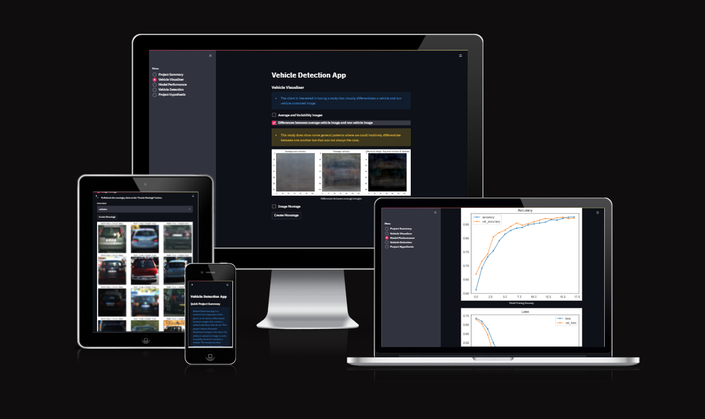
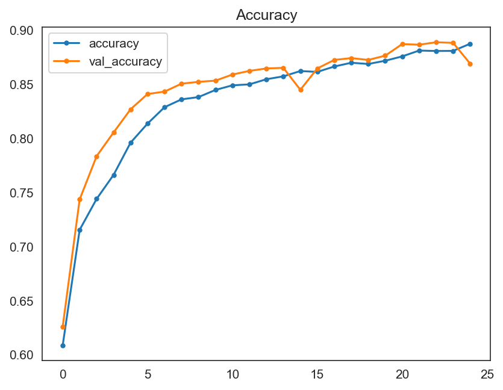
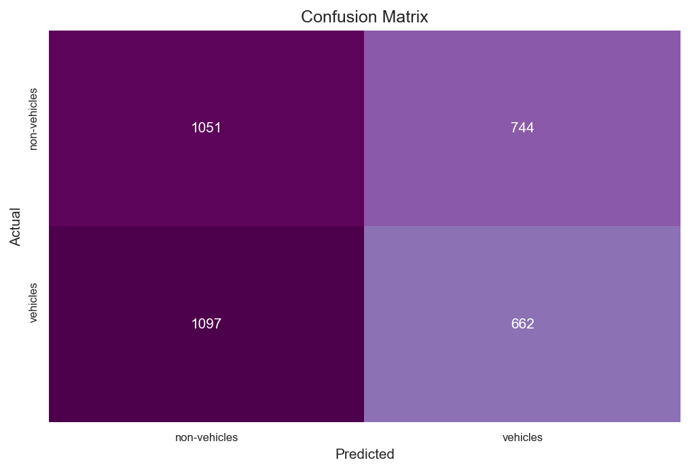

# Vehicle Detector

# Table of Contents

1. [Dataset Content](#dataset-content)
2. [Business Requirements](#business-requirements)
3. [Hypothesis and how to validate it?](#hypothesis-and-how-to-validate)
4. [The rationale to map the business requirements to the Data Visualizations and ML tasks](#the-rationale-to-map-the-business-requirements-to-the-data-visualizations-and-ml-tasks)
5. [ML Business Case](#ml-business-case)
6. [ML Model Development](#ml-model-development)
   1. [Version 1](#version-1)
7. [Hypotheses - Considerations and Validations](#hypotheses---considerations-and-validations)
8. [Dashboard Design](#dashboard-design)
9.  [Unfixed Bugs](#unfixed-bugs)
10. [Deployment](#deployment)
11. [Main Data Analysis and Machine Learning Libraries](#main-data-analysis-and-machine-learning-libraries)
12. [Other technologies used](#other-technologies-used)
13. [Issues](#issues)
14. [TESTING](#testing)
    1.  [Manual Testing](#manual-testing)
        1.  [User Story Testing](#user-story-testing)
    2. [Validation](#validation)
    3. [Automated Unit Tests](#automated-unit-tests)
15. [Credits](#credits)
    1.  [Content](#content)
16. [Acknowledgements](#acknowledgements)

## Dataset Content
The dataset is **Vehicle Detection Image Set** dataset from [Kaggle](https://www.kaggle.com/datasets/brsdincer/vehicle-detection-image-set). 

Two labels:
Non-Vehicles
Vehicles

This dataset is for machine learning process and computer vision steps and has 17760 images.

[Back to top ⇧](#table-of-contents)

## Business Requirements

Key Stakeholders, therefore should be:

Requirements:

[Back to top ⇧](#table-of-contents)

## Hypothesis and how to validate?

[Back to top ⇧](#table-of-contents)

## The rationale to map the business requirements to the Data Visualizations and ML tasks

**Business Requirement 1: Data Visualization**

**Business Requirement 2: Classification**

[Back to top ⇧](#table-of-contents)

## ML Business Case

[Back to top ⇧](#table-of-contents)

## ML Model Development

### Version 1

Dense Layers:

Compilation:

These are the results for the V1:

 

[Back to top ⇧](#table-of-contents)

## Hypotheses - Considerations and Validations

1. **Visual Differentiation Hypothesis:** 

2. **Deep Learning Classification Hypothesis:** 

The validation process for these hypotheses involved:

[Back to top ⇧](#table-of-contents)

## Dashboard Design

Project Summary

 

Vehicle Visualizer

Montage

 

Model Performance

 

Vehicle Detection

 

 

Vehcile Detection Outputs

 

- **Project Hypothesis**

Project Hypothesis

 

[Back to top ⇧](#table-of-contents)

## Unfixed Bugs
There are no unfixed bugs.

## Deployment
### Heroku

* The App live link is: [https://vehicle-detection-app-244022d2fd33.herokuapp.com/](https://vehicle-detection-app-244022d2fd33.herokuapp.com/)
* Set the runtime.txt Python version to a [Heroku-20](https://devcenter.heroku.com/articles/python-support#supported-runtimes) stack currently supported version.
* The project was deployed to Heroku using the following steps.

1. Log in to Heroku and create an App
2. Log into Heroku CLI in IDE workspace terminal using the bash command: *heroku login -i* and enter user credentials
3. Run the command *git init* to re-initialise the Git repository
4. Run the command *heroku git:remote -a "YOUR_APP_NAME"* to connect the workspace and your previously created Heroku app.
5. Set the app's stack to heroku-20 using the bash command: *heroku stack:set heroku-20* for compatibility with the Python 3.8.14 version used for this project
6. Deploy the application to Heroku using the following bash command: *git push heroku main*
7. The deployment process should happen smoothly if all deployment files are fully functional. On Heroku Dashboard click the button Open App on the top of the page to access your App.
8. If the slug size is too large then add large files not required for the app to the .slugignore file.

### Forking the GitHub Project
To make a copy of the GitHub repository to use on your own account, one can fork the repository by doing as follows:

* On the page for the [repository](https://github.com/Thephelpster/CI_PP5_VD), go to the 'Fork' button on the top right of the page, and click it to create a copy of the repository which should then be on your own GitHub account.

### Making a Local Clone

* On the page for the [repository](https://github.com/Thephelpster/CI_PP5_VD), click the 'Code' button
* To clone the repository using HTTPS, copy the HTTPS URL provided there
* Open your CLI application of choice and change the current working directory to the location where you want the cloned directory to be made.
* Type git clone, and then paste the previously copied URL to create the clone

[Back to top ⇧](#table-of-contents)

## Main Data Analysis and Machine Learning Libraries

List of the libraries used in the project

- [NumPy](https://numpy.org/)
- [Pandas](https://pandas.pydata.org/)
- [Matplotlib](https://matplotlib.org/)
- [Seaborn](https://seaborn.pydata.org/)
- [Plotly](https://plotly.com/python/)
- [TensorFlow](https://www.tensorflow.org/versions/r2.6/api_docs/python/tf)
- [Keras Tuner](https://keras.io/keras_tuner/)
- [Scikit-learn](https://scikit-learn.org/)
- [PIL Image](https://pillow.readthedocs.io/en/stable/reference/Image.html)

## Other technologies used
- [Streamlit](https://streamlit.io/)
- [Heroku](https://www.heroku.com/)
- [Git/GitHub](https://github.com/)
- [CodeAnywhere](https://www.codeanywhere.com/)
- [VS Code](https://code.visualstudio.com/)
- [Am I Responsive App](https://ui.dev/amiresponsive)

[Back to top ⇧](#table-of-contents)

### Issues

[Back to top ⇧](#table-of-contents)

## TESTING
### Manual Testing

#### User Story Testing
*Business Requirement 1: Data Visualization**
1.

**Vehicle Visualizer Page**

| Feature | Action | Expected Result | Actual Result |
| --- | --- | --- | --- |
|  |  |  |  |
|  |  |  |  |

| Feature | Action | Expected Result | Actual Result |
| --- | --- | --- | --- |
|  |  |  |  |

**Vehicle Detection Page**

| Feature | Action | Expected Result | Actual Result |
| --- | --- | --- | --- |
|  |  |  |  |

| Feature | Action | Expected Result | Actual Result |
| --- | --- | --- | --- |
|  |  |  |  |

[Back to top ⇧](#table-of-contents)

### Validation

### Automated Unit Tests
- There were no automated unit testing. It is planned for the future development.

[Back to top ⇧](#table-of-contents)

## Credits 

### Content 
With this project I followed the Code Institute Malaria Dectection Walkthrough and example.

## Acknowledgements
* A big thank you to Mo Shami, my mentor, for all the guidance, help and advice.

[Back to top ⇧](#table-of-contents)